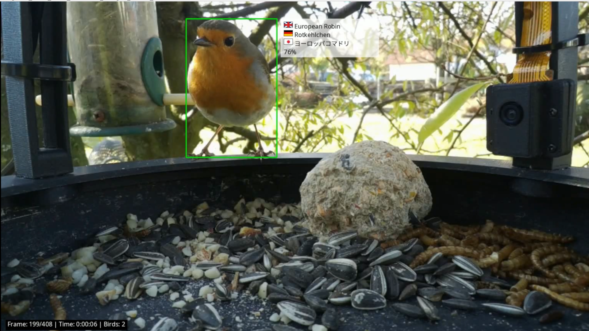

# 🐦 Vogel Video Analyzer



**Sprachen:** [🇬🇧 English](README.md) | [🇩🇪 Deutsch](README.de.md) | [🇯🇵 日本語](README.ja.md)

<p align="left">
  <a href="https://pypi.org/project/vogel-video-analyzer/"></a>
  <a href="https://pypi.org/project/vogel-video-analyzer/"></a>
  <a href="https://opensource.org/licenses/MIT"></a>
  <a href="https://pypi.org/project/vogel-video-analyzer/"></a>
  <a href="https://pepy.tech/project/vogel-video-analyzer"></a>
</p>

**YOLOv26-basiertes Videoanalyse-Tool zur automatisierten Erkennung und Quantifizierung von Vogelinhalten.**

Ein leistungsstarkes Kommandozeilen-Tool und Python-Bibliothek zur Analyse von Videos, um Vogelvorkommen mithilfe modernster YOLOv26-Objekterkennung zu erkennen und zu quantifizieren.

---

## ✨ Funktionen

- 🤖 **YOLOv26-basierte Erkennung** - Präzise Vogelerkennung mit vortrainierten Modellen
- 🦜 **Artenerkennung** - Identifiziert Vogelarten mit Hugging Face Modellen (optional)
- 📊 **HTML-Berichte (v0.5.0+)** - Interaktive visuelle Berichte mit Diagrammen und Thumbnails
  - Aktivitäts-Timeline zeigt Vogelerkennungen über Zeit
  - Arten-Verteilungsdiagramme
  - Thumbnail-Galerie der besten Erkennungen
  - Responsives Design für Desktop und Mobil
  - Eigenständige HTML-Dateien (keine externen Abhängigkeiten)
- 🎬 **Video-Annotation (v0.3.0+)** - Erstellen Sie annotierte Videos mit Bounding Boxes und Artenlabels
  - Automatische Ausgabepfad-Generierung mit Zeitstempel (`video.mp4` → `video_annotated_YYYYMMDD_HHMMSS.mp4`)
  - Mehrsprachige Artenlabels mit Flaggensymbolen (🇬🇧 🇩🇪 🇯🇵)
  - 🏴 **Eingebettete Flaggen-Darstellung (v0.5.10+)** - PNG-Flaggen im Code, null Dateiabhängigkeiten
  - 🏴 **Hybrid-Flaggen-Darstellung (v0.4.2+)** - PNG-Bilder mit automatischem Fallback zu eigenem --flag-dir
  - Konfigurierbare Schriftgrößen für optimale Lesbarkeit
  - Audiokonservierung aus dem Original-Video
  - Flimmerfreie Bounding Boxes mit Erkennungs-Caching
  - Batch-Verarbeitung für mehrere Videos
  - Rechts positionierte semi-transparente Beschriftungsfelder
- 🌍 **Multilingual-Support (v0.3.0+)** - Vogelnamen auf Englisch, Deutsch und Japanisch mit vollständiger Gebietserkennung
  - 39 Vogelarten mit vollständigen Übersetzungen
  - Alle 8 deutschen Modellvögel unterstützt (kamera-linux/german-bird-classifier-v2)
  - **Japanisch (v0.5.10+)**: Auto-Erkennung von `ja_JP.utf8` und `ja_JP.eucjp` Gebietsschemata
  - Anzeigeformat: "EN: Kernbeißer / DE: Kernbeißer / 75%" oder "🇬🇧 Hawfinch / 🇩🇪 Kernbeißer / 🇯🇵 アオガラ / 72%"
  - Sprache einstellen über `--language ja` oder `VOGEL_LANG=ja` Umgebungsvariable
- 📊 **Detaillierte Statistiken** - Frame-für-Frame-Analyse mit Vogelinhalt in Prozent
- 🎯 **Segment-Erkennung** - Identifiziert zusammenhängende Zeitperioden mit Vogelvorkommen
- ⚡ **Performance-Optimiert** - Konfigurierbare Sample-Rate für schnellere Verarbeitung
- 📄 **JSON-Export** - Strukturierte Berichte zur Archivierung und Weiterverarbeitung
- 🗑️ **Intelligentes Auto-Löschen** - Entfernt Videodateien oder Ordner ohne Vogelinhalt
- 📝 **Logging-Unterstützung** - Strukturierte Logs für Batch-Verarbeitungs-Workflows
- 📋 **Issue Board (v0.5.3+)** - Integriertes Projektmanagement und Issue-Tracking
  - Lokale Issue-Verwaltung mit Status, Priorität und Labels
  - Optionale GitHub Issues Synchronisation
  - CLI-Befehl `vogel-issues` für den kompletten Issue-Lebenszyklus
- ⚡ **Raspberry Pi AI HAT+ / Hailo-8 NPU (v0.5.12+)** - Hardware-beschleunigtes Inferencing auf dem Raspberry Pi 5
  - Drop-in `--engine hailo` Backend, keine Code-Änderungen nötig
  - `--hef-model` für kompilierte HEF-Dateien
  - `--export-onnx` konvertiert `.pt` → `.onnx` für den Hailo Dataflow Compiler
  - Getestet mit HailoRT 4.23.0 und Hailo-8 AI HAT+ (26 TOPS)
- 📚 **Bibliothek & CLI** - Als eigenständiges Tool oder in Python-Projekten integrierbar

## 🔐 Security-Audit (v0.5.5)

Letztes Audit-Datum: **2026-02-15**

- **Bandit (Code-Scan):** 16 Low, 0 Medium, 0 High
- **pip-audit (Dependency-Scan):** Keine bekannten Schwachstellen gefunden
- **Wichtigste Security-Fixes in v0.5.5:**
  - Expliziter Timeout für GitHub-GraphQL-Requests ergänzt
  - Validierung für externen Chart.js-Download gehärtet (HTTPS + Allowlist-Host)
  - Mindestversion von `pillow` auf `12.1.1` angehoben

Siehe [SECURITY.md](SECURITY.md) für Meldung und Sicherheitsrichtlinie.

---

## 🎓 Möchten Sie Ihren eigenen Arten-Klassifikator trainieren?

Schauen Sie sich **[vogel-model-trainer](https://github.com/kamera-linux/vogel-model-trainer)** an, um Trainingsdaten aus Ihren Videos zu extrahieren und eigene Modelle für Ihre lokalen Vogelarten zu erstellen!

**Warum ein eigenes Modell trainieren?**
- Vortrainierte Modelle identifizieren europäische Gartenvögel oft falsch als exotische Arten
- Eigene Modelle erreichen >90% Genauigkeit für IHRE spezifischen Vögel
- Training auf IHRE Kamera-Aufnahmen und Lichtverhältnisse abgestimmt

👉 **[Erste Schritte mit vogel-model-trainer →](https://github.com/kamera-linux/vogel-model-trainer)**

---

## 🚀 Schnellstart

### Installation

#### Empfohlen: Mit virtueller Umgebung

```bash
# venv installieren falls nötig (Debian/Ubuntu)
sudo apt install python3-venv

# Virtuelle Umgebung erstellen
python3 -m venv ~/venv-vogel

# Aktivieren
source ~/venv-vogel/bin/activate  # Unter Windows: ~/venv-vogel\Scripts\activate

# Paket installieren
pip install vogel-video-analyzer
```

#### Direkte Installation

```bash
pip install vogel-video-analyzer
```

### Grundlegende Verwendung

```bash
# Einzelnes Video analysieren
vogel-analyze video.mp4

# Vogelarten identifizieren
vogel-analyze --identify-species video.mp4

# HTML-Bericht erstellen (v0.5.0+)
vogel-analyze --language en --identify-species --species-model kamera-linux/german-bird-classifier-v2 --species-threshold 0.80 --html-report report.html --sample-rate 15 --max-thumbnails 12 video.mp4
# Beispiel ansehen: https://htmlpreview.github.io/?https://github.com/kamera-linux/vogel-video-analyzer/blob/main/examples/html_report_example.html

# Annotiertes Video mit Bounding Boxes und Artenlabels erstellen (v0.3.0+)
vogel-analyze --identify-species \
  --annotate-video \
  video.mp4
# Ausgabe: video_annotated.mp4 (automatisch)

# Kombinierte Ausgaben: JSON + HTML-Bericht
vogel-analyze --identify-species -o daten.json --html-report bericht.html video.mp4

# Schnellere Analyse (jedes 5. Frame)
vogel-analyze --sample-rate 5 video.mp4

# Als JSON exportieren
vogel-analyze --output report.json video.mp4

# Nur Videodateien mit 0% Vogelinhalt löschen
vogel-analyze --delete-file *.mp4

# Ganze Ordner mit 0% Vogelinhalt löschen
vogel-analyze --delete-folder ~/Videos/*/*.mp4

# Verzeichnis batch-verarbeiten
vogel-analyze ~/Videos/Birds/**/*.mp4

# Raspberry Pi AI HAT+ / Hailo-8 NPU (v0.5.12+)
# HailoRT-Treiber installieren: sudo apt install hailo-all
vogel-analyze --export-onnx yolov8n.pt                # .pt → .onnx exportieren
# (.onnx → .hef mit Hailo Dataflow Compiler auf x86 kompilieren)
vogel-analyze --engine hailo --hef-model yolov8n.hef video.mp4
```

---

## 📖 Verwendungsbeispiele

### Kommandozeilen-Interface

#### Basis-Analyse
```bash
# Einzelnes Video mit Standardeinstellungen analysieren
vogel-analyze bird_video.mp4
```

**Ausgabe:**
```
🎬 Video Analysis Report
━━━━━━━━━━━━━━━━━━━━━━━━━━━━━━━━━━━━━━━━━━━━━━━━━━━━━━━━━━━━━━━━━
📁 Datei: /path/to/bird_video.mp4
📊 Gesamt-Frames: 450 (analysiert: 90)
⏱️  Dauer: 15.0 Sekunden
🐦 Vogel-Frames: 72 (80.0%)
🎯 Vogel-Segmente: 2

📍 Erkannte Segmente:
  ┌ Segment 1: 00:00:02 - 00:00:08 (72% Vogel-Frames)
  └ Segment 2: 00:00:11 - 00:00:14 (89% Vogel-Frames)

✅ Status: Signifikante Vogelaktivität erkannt
━━━━━━━━━━━━━━━━━━━━━━━━━━━━━━━━━━━━━━━━━━━━━━━━━━━━━━━━━━━━━━━━━
```

#### Artenerkennung (Optional)
```bash
# Vogelarten im Video identifizieren
vogel-analyze --identify-species bird_video.mp4
```

**Ausgabe:**
```
🎬 Videoanalyse-Bericht
━━━━━━━━━━━━━━━━━━━━━━━━━━━━━━━━━━━━━━━━━━━━━━━━━━━━━━━━━━━━━━━━━
📁 Datei: /path/to/bird_video.mp4
📊 Gesamt-Frames: 450 (analysiert: 90)
⏱️  Dauer: 15.0 Sekunden
🐦 Vogel-Frames: 72 (80.0%)
🎯 Vogel-Segmente: 2

📍 Erkannte Segmente:
  ┌ Segment 1: 00:00:02 - 00:00:08 (72% Vogel-Frames)
  └ Segment 2: 00:00:11 - 00:00:14 (89% Vogel-Frames)

✅ Status: Signifikante Vogelaktivität erkannt

🦜 Erkannte Arten:
   3 Arten erkannt

  • Parus major (Kohlmeise)
    45 Erkennungen (Ø Konfidenz: 0.89)
  • Turdus merula (Amsel)
    18 Erkennungen (Ø Konfidenz: 0.85)
  • Erithacus rubecula (Rotkehlchen)
    9 Erkennungen (Ø Konfidenz: 0.82)
━━━━━━━━━━━━━━━━━━━━━━━━━━━━━━━━━━━━━━━━━━━━━━━━━━━━━━━━━━━━━━━━━
```

**⚠️ Experimentelle Funktion:** Vortrainierte Modelle können europäische Gartenvögel als exotische Arten fehlidentifizieren. Für präzise Identifizierung lokaler Vogelarten empfiehlt sich das Training eines eigenen Modells (siehe [Eigenes Modell trainieren](#-eigenes-modell-trainieren)).

Beim ersten Ausführen der Artenerkennung wird das Modell (~100-300MB) automatisch heruntergeladen und lokal für zukünftige Verwendung gecacht.

**🚀 GPU-Beschleunigung:** Die Artenerkennung nutzt automatisch CUDA (NVIDIA GPU) falls verfügbar, was die Inferenz erheblich beschleunigt. Bei fehlender GPU wird automatisch auf CPU zurückgegriffen.

#### Eigene Modelle verwenden

Du kannst lokal trainierte Modelle für bessere Genauigkeit mit deinen spezifischen Vogelarten verwenden:

```bash
# Eigenes Modell verwenden
vogel-analyze --identify-species --species-model ~/vogel-models/my-model/ video.mp4

# Mit angepasstem Konfidenz-Schwellenwert (Standard: 0.3)
vogel-analyze --identify-species \
  --species-model ~/vogel-models/my-model/ \
  --species-threshold 0.5 \
  video.mp4
```

**Schwellenwert-Richtlinien:**
- `0.1-0.2` - Maximale Erkennungen (explorative Analyse)
- `0.3-0.5` - Ausgewogen (empfohlen)
- `0.6-0.9` - Nur hohe Konfidenz

Siehe Abschnitt [Eigenes Modell trainieren](#-eigenes-modell-trainieren) für Details zum Training.

#### Video-Annotation (v0.3.0+)

Erstellen Sie annotierte Videos mit Bounding Boxes und Artenlabels:

```bash
# Basis-Annotation mit automatischem Ausgabepfad
vogel-analyze --identify-species \
  --annotate-video \
  input.mp4
# Ausgabe: input_annotated.mp4

# Mit benutzerdefiniertem Modell und schnellerer Verarbeitung
vogel-analyze --identify-species \
  --species-model kamera-linux/german-bird-classifier-v2 \
  --sample-rate 3 \
  --annotate-video \
  mein_video.mp4
# Ausgabe: mein_video_annotated.mp4

# Benutzerdefinierter Ausgabepfad (nur einzelnes Video)
vogel-analyze --identify-species \
  --annotate-video \
  --annotate-output eigene_ausgabe.mp4 \
  input.mp4

# Mehrere Videos gleichzeitig verarbeiten
vogel-analyze --identify-species \
  --annotate-video \
  --multilingual \
  *.mp4
# Erstellt: video1_annotated.mp4, video2_annotated.mp4, usw.
```

**Features:**
- 📦 **Bounding Boxes** um erkannte Vögel (grün)
- 🏷️ **Artenlabels** mit Konfidenzwerten
- ⏱️ **Zeitstempel-Overlay** mit Frame-Nummer und Zeit
- 📊 **Echtzeit-Fortschritt** Anzeige

**Performance-Tipps:**
- Verwenden Sie `--sample-rate 2` oder höher für schnellere Verarbeitung (annotiert jedes N-te Frame)
- Das Ausgabevideo behält die ursprüngliche Auflösung und Framerate bei
- Verarbeitungszeit hängt von Videolänge und Komplexität der Artenklassifizierung ab

#### Video-Zusammenfassung (v0.3.1+)

Erstellen Sie komprimierte Videos, indem Sie Segmente ohne Vogelaktivität überspringen:

```bash
# Basis-Zusammenfassung mit Standardeinstellungen
vogel-analyze --create-summary video.mp4
# Ausgabe: video_summary.mp4

# Benutzerdefinierte Schwellenwerte
vogel-analyze --create-summary \
  --skip-empty-seconds 5.0 \
  --min-activity-duration 1.0 \
  video.mp4

# Benutzerdefinierter Ausgabepfad (nur einzelnes Video)
vogel-analyze --create-summary \
  --summary-output eigene_zusammenfassung.mp4 \
  video.mp4

# Mehrere Videos gleichzeitig verarbeiten
vogel-analyze --create-summary *.mp4
# Erstellt: video1_summary.mp4, video2_summary.mp4, usw.

# Kombination mit schnellerer Verarbeitung
vogel-analyze --create-summary \
  --sample-rate 10 \
  video.mp4
```

**Features:**
- ✂️ **Intelligente Segment-Erkennung** - Erkennt automatisch Vogelaktivitäts-Perioden
- 🎵 **Audio-Erhaltung** - Perfekte Audio-Synchronisation (keine Tonhöhen-/Geschwindigkeitsänderungen)
- ⚙️ **Konfigurierbare Schwellenwerte**:
  - `--skip-empty-seconds` (Standard: 3.0) - Mindestdauer vogelfreier Segmente zum Überspringen
  - `--min-activity-duration` (Standard: 2.0) - Mindestdauer von Vogelaktivität zum Behalten
- 📊 **Kompressionsstatistiken** - Zeigt Original- vs. Zusammenfassungs-Dauer
- ⚡ **Schnelle Verarbeitung** - Nutzt ffmpeg concat (keine Re-Codierung)
- 📁 **Automatische Pfadgenerierung** - Speichert als `<original>_summary.mp4`

**Wie es funktioniert:**
1. Analysiert Video Frame für Frame zur Vogelerkennung
2. Identifiziert kontinuierliche Segmente mit/ohne Vögel
3. Filtert Segmente basierend auf Dauer-Schwellenwerten
4. Verkettet Segmente mit Audio mittels ffmpeg
5. Gibt Kompressionsstatistiken zurück

**Beispiel-Ausgabe:**
```
🔍 Analysiere Video für Vogelaktivität: video.mp4...
   📊 Analysiere 18000 Frames bei 30.0 FPS...
   ✅ Analyse abgeschlossen - 1250 Frames mit Vögeln erkannt

📊 Vogelaktivitäts-Segmente identifiziert
   📊 Beizubehaltende Segmente: 8
   ⏱️  Original-Dauer: 0:10:00
   ⏱️  Zusammenfassungs-Dauer: 0:02:45
   📉 Kompression: 72.5% kürzer

🎬 Erstelle Zusammenfassungs-Video: video_summary.mp4...
   ✅ Zusammenfassungs-Video erfolgreich erstellt
   📁 video_summary.mp4
```

#### Erweiterte Optionen
```bash
# Benutzerdefinierter Schwellenwert und Sample-Rate
vogel-analyze --threshold 0.4 --sample-rate 10 video.mp4

# Artenerkennung mit Konfidenz-Anpassung
vogel-analyze --identify-species --species-threshold 0.4 video.mp4
vogel-analyze --identify-species --sample-rate 10 video.mp4

# Ausgabesprache festlegen (en/de/ja, standardmäßig automatisch erkannt)
vogel-analyze --language de video.mp4

# Nur Videodateien mit 0% Vogelinhalt löschen
vogel-analyze --delete-file --sample-rate 5 *.mp4

# Ganze Ordner mit 0% Vogelinhalt löschen
vogel-analyze --delete-folder --sample-rate 5 ~/Videos/*/*.mp4

# JSON-Bericht und Log speichern
vogel-analyze --output report.json --log video.mp4
```

### Python-Bibliothek

```python
from vogel_video_analyzer import VideoAnalyzer

# Analyzer initialisieren (Basis)
analyzer = VideoAnalyzer(
    model_path="yolo26n.pt",
    threshold=0.3
)

# Analyzer mit Artenerkennung initialisieren
analyzer = VideoAnalyzer(
    model_path="yolo26n.pt",
    threshold=0.3,
    identify_species=True
)

# Video analysieren
```
```

#### Erweiterte Optionen
```bash
# Benutzerdefinierter Schwellenwert und Sample-Rate
vogel-analyze --threshold 0.4 --sample-rate 10 video.mp4

# Ausgabesprache festlegen (en/de, standardmäßig automatisch erkannt)
vogel-analyze --language de video.mp4

# Nur Videodateien mit 0% Vogelinhalt löschen
vogel-analyze --delete-file --sample-rate 5 *.mp4

# Ganze Ordner mit 0% Vogelinhalt löschen
vogel-analyze --delete-folder --sample-rate 5 ~/Videos/*/*.mp4

# JSON-Bericht und Log speichern
vogel-analyze --output report.json --log video.mp4
```

### Python-Bibliothek

```python
from vogel_video_analyzer import VideoAnalyzer

# Analyzer initialisieren
analyzer = VideoAnalyzer(
    model_path="yolo26n.pt",
    threshold=0.3
)

# Video analysieren
stats = analyzer.analyze_video("bird_video.mp4", sample_rate=5)

# Formatierten Bericht ausgeben
analyzer.print_report(stats)

# Auf Statistiken zugreifen
print(f"Vogelinhalt: {stats['bird_percentage']:.1f}%")
print(f"Gefundene Segmente: {len(stats['bird_segments'])}")
```

---

## 🎯 Anwendungsfälle

### 1. Qualitätskontrolle für Vogelaufnahmen
Automatisch überprüfen, ob aufgenommene Videos tatsächlich Vögel enthalten:

```bash
vogel-analyze --threshold 0.5 --delete-file recordings/**/*.mp4
```

### 2. Archivverwaltung
Videos ohne Vogelinhalt identifizieren und entfernen, um Speicherplatz zu sparen:

```bash
# Videos mit 0% Vogelinhalt finden
vogel-analyze --output stats.json archive/**/*.mp4

# Nur leere Videodateien löschen
vogel-analyze --delete-file archive/**/*.mp4

# Gesamte Ordner mit 0% Vogelinhalt löschen
vogel-analyze --delete-folder archive/**/*.mp4
```

### 3. Batch-Analyse für Forschung
Große Videosammlungen verarbeiten und strukturierte Berichte erstellen:

```bash
# Alle Videos analysieren und individuelle Berichte speichern
for video in research_data/**/*.mp4; do
    vogel-analyze --sample-rate 10 --output "${video%.mp4}_report.json" "$video"
done
```

### 4. Integration in Automatisierungs-Workflows
Als Teil automatisierter Aufnahme-Pipelines verwenden:

```python
from vogel_video_analyzer import VideoAnalyzer

analyzer = VideoAnalyzer(threshold=0.3)
stats = analyzer.analyze_video("latest_recording.mp4", sample_rate=5)

# Nur Videos mit signifikantem Vogelinhalt behalten
if stats['bird_percentage'] < 10:
    print("Unzureichender Vogelinhalt, lösche...")
    # Löschung handhaben
else:
    print(f"✅ Qualitätsvideo: {stats['bird_percentage']:.1f}% Vogelinhalt")
```

---

## ⚙️ Konfigurationsoptionen

| Option | Beschreibung | Standard | Werte |
|--------|-------------|---------|--------|
| `--model` | Zu verwendendes YOLO-Modell | `yolo26n.pt` | Beliebiges YOLO-Modell |
| `--threshold` | Konfidenz-Schwellenwert | `0.3` | `0.0` - `1.0` |
| `--sample-rate` | Jedes N-te Frame analysieren | `5` | `1` - `∞` |
| `--output` | JSON-Bericht speichern | - | Dateipfad |
| `--delete` | Videos mit 0% auto-löschen | `False` | Flag |
| `--log` | Logging aktivieren | `False` | Flag |

### Sample-Rate-Empfehlungen

| Video-FPS | Sample-Rate | Analysierte Frames | Performance |
|-----------|-------------|-------------------|-------------|
| 30 fps | 1 | 100% (alle Frames) | Langsam, höchste Präzision |
| 30 fps | 5 | 20% | ⭐ **Empfohlen** - Gute Balance |
| 30 fps | 10 | 10% | Schnell, ausreichend |
| 30 fps | 20 | 5% | Sehr schnell, Basis-Check |

### Schwellenwerte

| Schwellenwert | Beschreibung | Anwendungsfall |
|--------------|-------------|----------------|
| 0.2 | Sehr empfindlich | Erkennt entfernte/teilweise verdeckte Vögel |
| 0.3 | **Standard** | Ausgewogene Erkennung |
| 0.5 | Konservativ | Nur deutlich sichtbare Vögel |
| 0.7 | Sehr strikt | Nur perfekte Erkennungen |

---

## 🔍 Technische Details

### Modell-Such-Hierarchie

Der Analyzer sucht YOLOv26-Modelle in dieser Reihenfolge:

1. `models/` Verzeichnis (lokal)
2. `config/models/` Verzeichnis
3. Aktuelles Verzeichnis
4. Auto-Download von Ultralytics (Fallback)

### Erkennungs-Algorithmus

- **Zielklasse:** Vogel (COCO-Klasse 14)
- **Inferenz:** Frame-für-Frame YOLOv26-Erkennung
- **Segment-Erkennung:** Gruppiert aufeinanderfolgende Vogel-Frames mit max. 2-Sekunden-Lücken
- **Performance:** ~5x Beschleunigung mit sample-rate=5 bei 30fps-Videos

### Artenerkennung (GPU-Optimiert)

- **GPU Batch-Processing:** Verarbeitet alle Vogel-Crops pro Frame gleichzeitig (v0.4.4+)
  - Einzelne Batch-Inferenz für alle erkannten Vögel in einem Frame
  - Bis zu 8 Crops parallel verarbeitet (`batch_size=8`)
  - Bis zu 8x schneller als sequenzielle Verarbeitung
  - Eliminiert "pipelines sequentially on GPU" Warnung
- **Geräteauswahl:** Automatische CUDA (NVIDIA GPU) Erkennung mit CPU-Fallback
- **Modell-Laden:** Download von Hugging Face Hub (~100-300MB, lokal gecacht)
- **Schwellenwert-Filterung:** Konfigurierbarer Konfidenz-Schwellenwert (Standard: 0.3)
- **Mehrsprachige Unterstützung:** Vogelnamen auf Englisch, Deutsch und Japanisch (39 Arten)

### Ausgabeformat

JSON-Berichte enthalten:
```json
{
  "video_file": "bird_video.mp4",
  "duration_seconds": 15.0,
  "total_frames": 450,
  "frames_analyzed": 90,
  "bird_percentage": 80.0,
  "bird_segments": [
    {
      "start": 2.0,
      "end": 8.0,
      "detections": 36
    }
  ]
}
```

---

## 🎓 Eigenes Modell trainieren

Vortrainierte Vogelarten-Klassifizierer sind auf globalen Datensätzen trainiert und identifizieren europäische Gartenvögel oft als exotische Arten. Für bessere Genauigkeit mit deinen spezifischen Vogelarten kannst du ein eigenes Modell trainieren.

### Warum ein eigenes Modell trainieren?

**Problem mit vortrainierten Modellen:**
- Identifizieren häufige europäische Vögel (Kohlmeise, Blaumeise) als exotische asiatische Fasane
- Niedrige Konfidenzwerte (oft <0.1)
- Trainiert auf Datensätzen mit Fokus auf amerikanische und exotische Vögel

**Vorteile eigener Modelle:**
- Hohe Genauigkeit für DEINE spezifischen Vogelarten
- Trainiert auf DEINE Kamera-Konfiguration und Lichtverhältnisse
- Konfidenzwerte >0.9 für korrekt identifizierte Vögel

### Schnellstart

Die Training-Tools sind jetzt als eigenständiges Paket verfügbar: **[vogel-model-trainer](https://github.com/kamera-linux/vogel-model-trainer)**

**1. Training-Paket installieren:**
```bash
pip install vogel-model-trainer
```

**2. Vogelbilder aus Videos extrahieren:**
```bash
vogel-trainer extract ~/Videos/kohlmeise.mp4 \
  --folder ~/vogel-training-data/ \
  --bird kohlmeise \
  --sample-rate 3
```

**3. Datensatz organisieren (80/20 Train/Val Split):**
```bash
vogel-trainer organize \
  --source ~/vogel-training-data/ \
  --output ~/vogel-training-data/organized/
```

**4. Modell trainieren (benötigt ~3-4 Stunden auf Raspberry Pi 5):**
```bash
vogel-trainer train
```

**5. Trainiertes Modell verwenden:**
```bash
vogel-analyze --identify-species \
  --species-model ~/vogel-models/bird-classifier-*/final/ \
  video.mp4
```

### Empfohlene Datensatz-Größe

- **Minimum:** 30-50 Bilder pro Vogelart
- **Optimal:** 100+ Bilder pro Vogelart
- **Balance:** Ähnliche Anzahl Bilder für jede Art

### Vollständige Dokumentation

Siehe die **[vogel-model-trainer Dokumentation](https://github.com/kamera-linux/vogel-model-trainer)** für:
- Kompletter Training-Workflow
- Iteratives Training für bessere Genauigkeit
- Erweiterte Nutzung und Fehlerbehebung
- Performance-Tipps und Best Practices

---

## 📚 Dokumentation

- **GitHub Repository:** [vogel-video-analyzer](https://github.com/kamera-linux/vogel-video-analyzer)
- **Elternprojekt:** [vogel-kamera-linux](https://github.com/kamera-linux/vogel-kamera-linux)
- **Issue Tracker:** [GitHub Issues](https://github.com/kamera-linux/vogel-video-analyzer/issues)

---

## 🤝 Mitwirken

Beiträge sind willkommen! Wir freuen uns über Fehlerberichte, Feature-Vorschläge, Dokumentationsverbesserungen und Code-Beiträge.

Bitte lesen Sie unseren [Contributing Guide](CONTRIBUTING.md) für Details zu:
- Einrichtung Ihrer Entwicklungsumgebung
- Unseren Code-Stil und Richtlinien
- Den Pull-Request-Prozess
- Wie man Fehler meldet und Features vorschlägt

Für Sicherheitslücken siehe bitte unsere [Sicherheitsrichtlinie](SECURITY.md).

---

## 📄 Lizenz

Dieses Projekt ist unter der MIT-Lizenz lizenziert - siehe die [LICENSE](LICENSE)-Datei für Details.

---

## 🙏 Danksagungen

- **Ultralytics YOLOv26** - Leistungsstarkes Objekterkennungs-Framework
- **OpenCV** - Computer-Vision-Bibliothek
- **Vogel-Kamera-Linux** - Elternprojekt für automatisierte Vogelbeobachtung

---

## 📞 Support

- **Issues:** [GitHub Issues](https://github.com/kamera-linux/vogel-video-analyzer/issues)
- **Diskussionen:** [GitHub Discussions](https://github.com/kamera-linux/vogel-video-analyzer/discussions)

---

**Mit ❤️ erstellt vom Vogel-Kamera-Linux Team**
